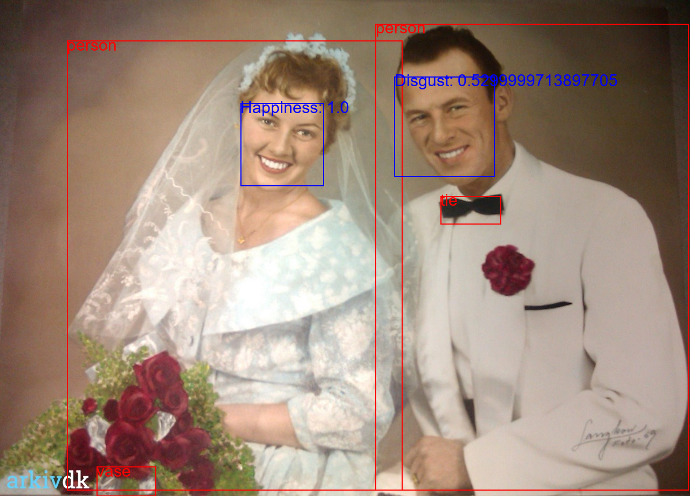
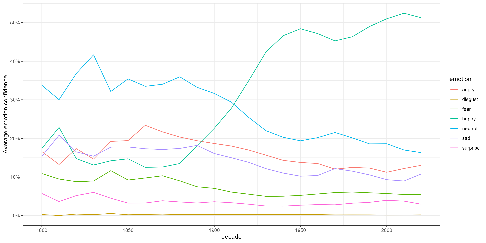

```{r xaringan-panelset, echo=FALSE}
xaringanExtra::use_panelset()
```

```{r xaringan-tile-view, echo=FALSE}
xaringanExtra::use_tile_view()
```

```{r xaringanExtra, echo = FALSE}
xaringanExtra::use_progress_bar(color = "#808080", location = "top")
```

```{css echo=FALSE}
.pull-left {
  float: left;
  width: 44%;
}
.pull-right {
  float: right;
  width: 44%;
}
.pull-right ~ p {
  clear: both;
}


.pull-left-wide {
  float: left;
  width: 66%;
}
.pull-right-wide {
  float: right;
  width: 66%;
}
.pull-right-wide ~ p {
  clear: both;
}

.pull-left-narrow {
  float: left;
  width: 33%;
}
.pull-right-narrow {
  float: right;
  width: 33%;
}

.small123 {
  font-size: 0.80em;
}

.large123 {
  font-size: 2em;
}

.red {
  color: red
}

.xsmall123 {
  font-size: 0.60em;
}

.pull-center {
  margin-left: auto;
  margin-right: auto;
  width: 50%;
  text-align: left;
}

.pull-center-narrow {
  margin-left: auto;
  margin-right: auto;
  width: 30%;
  text-align: left;
}
```


.pull-left-wide[
# Railways and the Happy Danes

### Motivaiton
- Does economic development cause increased level of well-being?
- Railways brings prosperity and new ideas, but is this then converted into increased levels of happiness?


### This presentation
- Using off-the-shelf ML, we analyzing 2M geo-located pictures to find an answer
- Some preliminary results
]

.pull-right-narrow[
Example picture from Arkiv.dk
 
https://arkiv.dk/vis/178152


.small123[
*Source: Arkiv.dk*
]
]


---
class: inverse, center, middle

# Background

---
class: center, middle

# The hypothesis in summary (preview)

.pull-center[
1. Railways brought modern production and modern ideas 
2. In the Danish case the central idea was Grundtvigianism 
3. Railways made people happier. Market access shapes emotional well-being (?*) 
]


.footnote[
.small123[
  *The null finding is also rather interesting: Interconnectedness having no effect on well-being.
]
]


---
# Literature

.pull-left[
.small123[
- Fogel (1964): Social savings reveals small effect
- Atack, Bateman, Haines, Margo, (2010): DiD reveals large effect
- Donaldson & Hornbeck (2016): Market access approach reveals massive effect 
- Berger, Enflo, K. (2017): Large persistent effect in Sweden 
- Berger (2019): No spill-over on population - some spill-over on industry
- Zimran (2020): Urbanization and health
- Bogart, You, Alvarez-Palau, Satchell, Shaw-Taylor (2022): Urbanization and structural change
- Cermeño, Enflo, Lindvall (2022): Railroads, state and schooling
- Melander (2023): Railroads and social movements in Sweden
- Vedel (2024): Water infrastructure: 26 percent population growth in DK 
- Voth & Yanagizawa-Drott (2024): Image(s)

...*So much more*
]
]

.pull-right[

]

---
# Railways in Denmark 

.pull-left[
- First line opened between Roskilde and Copenhagen in 1847
- Many lines initiated in Fyn and Jutland by Petro, Brassey and Betts
- State railway company formed when they went bankrupt
- Main lines operated as state lines in most of the relevant period
]

.pull-right[

Petro, Brassey, Betts company ([Wikimedia commons](https://commons.wikimedia.org/wiki/File:Victoria_Bridge,_Montreal.jpg))
]

---
# Grundtvianism 
.pull-left-wide[
- The origin of the liberal Danish spirit
- NFS Grundtvig (1783-1872):
  + 'Founding father' of the first 'free' constitution in 1849 
  + Promoted the idea of 'Dannelse' (like ['Bildung'](https://en.wikipedia.org/wiki/Bildung))
  + Revitalised the study of vikings 
  + Wrote more than 30000 works 
  + His influence touches everything
  + Community houses: Local democracy
  + Høj skoler: Education of farmers (Folk high schools)
  + Cooperative creameries! (Important: Lampe & Sharp)
]

.pull-right-narrow[

.small123[
Grundtvigian Community House of Funen in Odense  
1971 (Stadsarkivet)
]
]


---
# Grundtvig's alleged impact on prosperity

.pull-left[
- Community Building: Social capital and trust, trustworthy institutions
- Human capital 
- Cultural identity
- Local democracy and societies
- *"Leave two Danes in a room and they will form at least three societies"*

  
.small123[*Agersnap, H. (1885) Generalforsamling i Ansager Andelsmejeri [wikimedia](https://commons.wikimedia.org/wiki/File:Generalforsamling_i_Ansager_Andelsmejeri.jpg)*]
]

.pull-right[
.small123[
  
C.A. Jensen (1843) 'Nikolaj Frederik Severin Grundtvig'. [Wikimedia commons](https://commons.wikimedia.org/wiki/File:N-f-s-grundtvig-portr%C3%A6t.jpg)
]
]

---

# Meanwhile in America...
.pull-left[
### Sad Danes - Inner Mission
.center[
  
]
(Holy Danes)
- Emphasis on assimilation 
- Focus on America
- Strict religious view
]

.pull-right[
### Happy Danes - Grundtvigianism 
.center[
  
]

- Danish language and traditon (folkliness) 
- Connection between belief and nationality
- Liberal values
- We show in Boberg et al (2023) how influential this was in the US-Danish communities
]

---
class: inverse, center, middle

# Testing out our idea in data

---
class: center, middle

# The hypothesis in summary

.pull-center[
1. Railways brought modern production and modern ideas 
2. In the Danish case the central idea was Grundtvigianism 
3. Railways made people happier. Market access shapes emotional well-being (?*) 
]


.footnote[
.small123[
  *The null finding is also rather interesting: Interconnectedness having no effect on well-being.
]
]

---
class: center

# The hypothesis in pictures
--

.pull-left-narrow[
.panelset[
.panel[.panel-name[Sad]
**Crilles Dirches & Ane Sophie Hans Johansens**
*https://arkiv.dk/vis/159960*

]
.panel[.panel-name[Fear]
**Master Taylor Mathias Jørgen Schrøder**
*https://arkiv.dk/vis/1042395*

]
.panel[.panel-name[Anger]
**Bodil Jensdatter**
*https://arkiv.dk/vis/369089*

]

]
]

--

.pull-right-wide[
.panelset[
.panel[.panel-name[Train]
**...But then**  

]

.panel[.panel-name[Happy 1]

**Thora Kirstine Thorsen**
*https://arkiv.dk/vis/178152*

]

.panel[.panel-name[Happy 2]

**Niels Aage Nielsen**
*https://arkiv.dk/vis/103676*

]

.panel[.panel-name[Happy 3]
**Inge, Grete & Axel**
*https://arkiv.dk/vis/114519*

]

.panel[.panel-name[Happy 4]
**Ena & Eriks wedding**
*https://arkiv.dk/vis/316474*

]
]
]


---
class: middle
# Hypothesis in terms of things we can measure:
1. Railways and markets
2. Railways and modern ideas
3. Pictures and happiness
4. Railways and happiness


---
# Data

.pull-left[
- Census data 1787-1901 (Link lives)
- HISCO codes for census descriptions (Dahl, Johansen, Vedel, 2024)
- Linking with parish borders and consistency (Vedel, 2024)
- Railroads shape files (Fertner 2013)
- Location of assembly houses (Trap 3/4; Bentzen, Boberg-Fazlic, Sharp, Skovsgaard, Vedel, 2023)
- For identification: Elevation data from Open Street Map
- Indidivual level happiness from pictures
]

.pull-right[
.small123[
.panelset[
.panel[.panel-name[1850]

]
.panel[.panel-name[1860]

]
.panel[.panel-name[1880]

]
.panel[.panel-name[1901]

]
]
]
]


---
class: middle
# Happiness from pictures

.pull-left[
### Method
- We use off the shelf object detection (DERT-ResNet-50): https://huggingface.co/facebook/detr-resnet-50 
- And off the shelf Facial Emotion Detection (FER library)

### Obvious problems

- Should you smile on a picture? Obviously a cultural matter
- AI quality and bias
- Selection: Pictures don't end up in local archives randomly
- We are working on addressing all of these. 
]

.pull-right[
**Thora Kirstine Thorsen**
*https://arkiv.dk/vis/178152*

]

---
# Number of pictures over time


---
# Objects


---
# Emotions


---
# Some ocular regression: Tommerup Stationsby
.center[
<iframe src="https://www.google.com/maps/embed?pb=!1m14!1m12!1m3!1d38285.490263207925!2d10.191880045700286!3d55.333963183235056!2m3!1f0!2f0!3f0!3m2!1i1024!2i768!4f13.1!5e1!3m2!1sen!2sdk!4v1701266724087!5m2!1sen!2sdk" width="600" height="450" style="border:0;" allowfullscreen="" loading="lazy" referrerpolicy="no-referrer-when-downgrade"></iframe>
]

---
# Empricial strategy

.pull-left[
- Difference in difference
- **Identifying assumption:**
  + Places with railways would have had a paralel developmental path given the absence of railways
- **Threats:**
  + Selection: Places on a prosperous path might be selected into connection. Or the opposite - deliberate investments targeted at growth. 
  
]

.pull-right[

]

---
# Least Cost Path instrument
.pull-left[
- The task of the first stage is to predict well (Mullainathan & Spiess, 2017)
- Classical approach: Linear trunk-lines
- But we can do much better: Least Cost Path (Herzog, 2013)
- Costs:
  + $cost(s) = 1 + (s/S)^2$, where $S$ is a parameter
  + It pays to cross a slope until it doesn't
- Compute optimal cost path using Dijkstra's algorithm
]

.pull-right[
.panelset[
.panel[.panel-name[Old map]

]
.panel[.panel-name[Predicted lines]

]
]
]

---
# Railways and the Economy
.panelset[
.panel[.panel-name[Railways and the Economy]
.small123[
| |(1) log(Pop)           |(2) log(Child women ratio) |(3) log(Manufacturing 789) |(4) log(hisclass avg) |(5) log(Born different county) |
|:-----------|:-----------|:-----------|:-----------|:-----------|:-----------|
|Connected_rail  |0.0652*** (0.0106) |0.0005 (0.0099)        |0.1202*** (0.0193)     |-0.0018 (0.0020)  |0.1465*** (0.0410)         |
|GIS_ID FE        |Yes                |Yes                    |Yes                    |Yes               |Yes                        |
|Year FE          |Yes                |Yes                    |Yes                    |Yes               |Yes                        |
|Observations    |6,374              |6,352                  |6,357                  |6,373             |6,282                      |
- Classical effect as expected
- Still novel for the DK setting
]

]
.panel[.panel-name[Railways and the Ideas (Grundtvig)]
.small123[
|Dependent Var.: |(1) Assembly house    |(2) log(MA assembly) |(3) High School        |(4) log(MA High) |
|:---------------|:-----------------|:----------------|:-----------------|:----------------|
|                |                  |                 |                  |                 |
|Connected_rail  |0.0560** (0.0185) |-0.0126 (0.0082) |0.0140** (0.0050) |0.0056 (0.0056)  |
|GIS_ID FE       |Yes               |Yes              |Yes               |Yes              |
|Year FE         |Yes               |Yes              |Yes               |Yes              |
|Observations    |100,485           |102,245          |324,005           |324,005          |
- Grudtvigian institutions specifically placed in connected places
]
]
]

.footnote[
.small123[
**This also holds using the CS estimator*
]
]

---
# Do smiling people correlate with happiness?

.pull-left-narrow[
### Approach
- We looked at the world happiness report and what they suggest is related to happiness in the cannonical 'Cantril Ladder' (Helliwell et al, 2023)

### Correlates we can find historical data for (still WIP):
- Income 
- Social support 
- Freedom to make life choices (education)
- Generosity 
]

.pull-right-wide[
.panelset[
.panel[.panel-name[Income]
.center[]
*Parish level occ. income and emoitons*
]
.panel[.panel-name[... more to come]
]
]
]

---
# Railways and pictures
.pull-left-narrow[
- Simple (log of) count of pictures in parish
- Fine grained year by year data
- Very long run (100s of years!)
- **ATT-estimate:**  0.0879 [0.0669, 0.1089] $\rightarrow$ 9 pct

- Effect of opening. None of closing.
]

.pull-right-wide[
.panelset[
.panel[.panel-name[Open]
.center[]
]

.panel[.panel-name[Open - cal.]
.center[]
]

.panel[.panel-name[Closed]
.center[]
]
.panel[.panel-name[Closed - cal.]
.center[]
]

]

]

---
# Railways and emotions
.pull-left-narrow[
- CS22 DiD estimator for individual pictures and whether their location (parish) is connected to the railway
- Very long run
]

.pull-right-wide[
.panelset[
.panel[.panel-name[Angry]
.center[]
]

.panel[.panel-name[Disgust]
.center[]
]

.panel[.panel-name[Fear]
.center[]
]

.panel[.panel-name[Happy]
.center[]
]

.panel[.panel-name[Neutral]
.center[]
]

.panel[.panel-name[Sad]
.center[]
]

.panel[.panel-name[Surprise]
.center[]
]

]

]


---
class: middle
# Conclusion
.pull-left[
- We turn pictures into data that we can analyze
- Scratching the surface of the complex interplay between institutions, geography, culture and institutions
- Railways improved classical economic outcomes and caused ideas to spread.
- Did people become happier?
- One or two papers?

**Feel free to reach out**  
Twitter: @ChristianVedel  
christian-vs@sam.sdu.dk  
]

.pull-right[

https://arkiv.dk/vis/1117673


*Would you smile if you were that person?*

]


