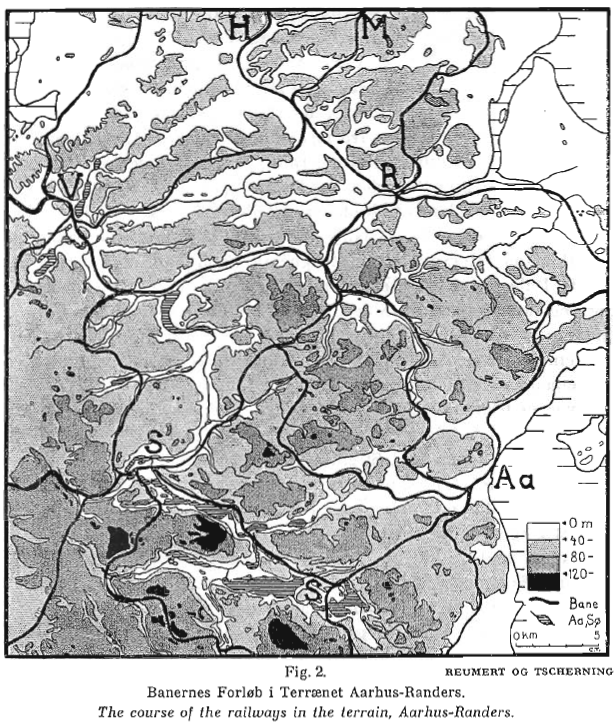
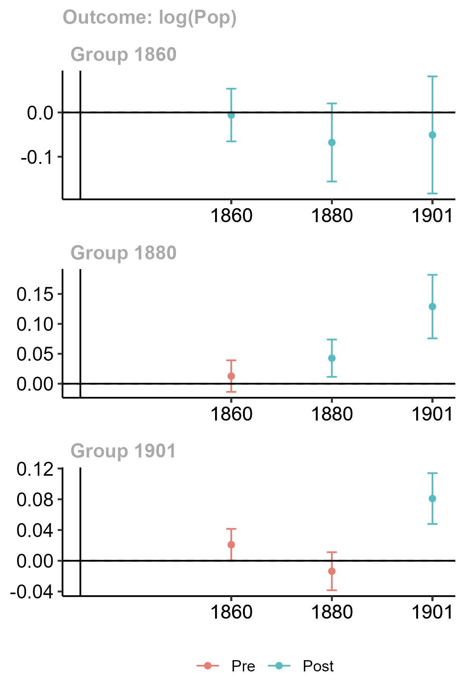
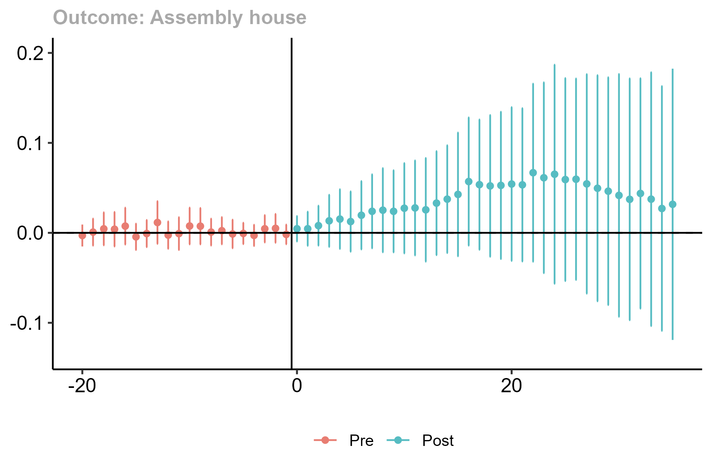
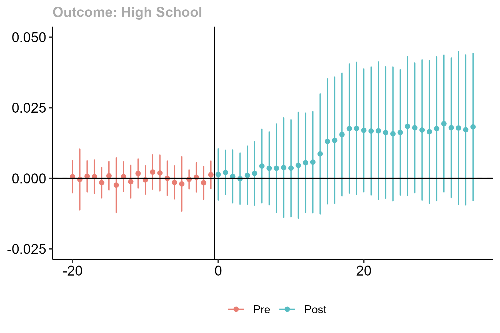

```{r xaringan-panelset, echo=FALSE}
xaringanExtra::use_panelset()
```

```{r xaringan-tile-view, echo=FALSE}
xaringanExtra::use_tile_view()
```

```{r xaringanExtra, echo = FALSE}
xaringanExtra::use_progress_bar(color = "#808080", location = "top")
```

```{css echo=FALSE}
.pull-left {
  float: left;
  width: 44%;
}
.pull-right {
  float: right;
  width: 44%;
}
.pull-right ~ p {
  clear: both;
}


.pull-left-wide {
  float: left;
  width: 66%;
}
.pull-right-wide {
  float: right;
  width: 66%;
}
.pull-right-wide ~ p {
  clear: both;
}

.pull-left-narrow {
  float: left;
  width: 33%;
}
.pull-right-narrow {
  float: right;
  width: 33%;
}

.small123 {
  font-size: 0.80em;
}

.large123 {
  font-size: 2em;
}

.red {
  color: red
}

.xsmall123 {
  font-size: 0.60em;
}
```

# Railways and the Happy Danes

.pull-left[
### Motivaiton
- It is reasonable to suppose that there is interplay between institutions, human capital, culture and geography (market access)
- **Hypothesis:** Danish railways brought Grudtvigianism - socalled 'happy' Danes

### This presentation
- Very preliminary - mostly speculative 
- Brief historical background
- Some preliminary results and ideas for identification
]

.pull-right[

]

---
# Origin
.pull-left-wide[
- Paul supervised Magnus' masters Thesis, which replicated Berger (2019) in Denmark 
- Tom started studying the influence of railways on human capital and social mobility 
- I've been interested in railways ever since I wrote my Bachelor thesis on it 


- Rough draft of the synergy of all these ideas: **Railways and the Happy Danes**
- Seemingly the first ever EH paper on Danish railways 

]

.pull-right-narrow[

.small123[*beta.dreamstudio.ai*]
]

---
# Literature

.pull-left[
*Vast literature*
.small123[
- Fogel (1964): Social savings reveals small effect
- Atack, Bateman, Haines, Margo, (2010): DiD reveals large effect
- Donaldson & Hornbeck (2016): Market access approach reveals massive effect 
- Berger, Enflo, K. (2017): Large persistent effect in Sweden 
- Berger (2019): No spill-over on population - some spill-over on industry
- Zimran (2020): Urbanization and health
- Bogart, You, Alvarez-Palau, Satchell, Shaw-Taylor (2022): Urbanization and structural change
- Cermeño, Enflo, Lindvall (2022): Railroads, state and schooling
- Vedel (2023): Infrastructure caused 24 percent population growth in DK  

...*So much more*
]
]

.pull-right[

]

---
# Railways in Denmark 

.pull-left[
- First line opened between Roskilde and Copenhagen in 1847
- Many lines initiated in Fyn and Jutland by Petro, Brassey and Betts
- State railway company formed when they went bankrupt 
]

.pull-right[

Petro, Brassey, Betts company ([Wikimedia commons](https://commons.wikimedia.org/wiki/File:Victoria_Bridge,_Montreal.jpg))
]


---
# Grundvianism 
.pull-left[
- The origin of the liberal Danish spirit
- NFS Grundtvig (1783-1872):
  + 'Founding father' of the first 'free' constitution in 1849 
  + Promoted the idea of 'Dannelse' (like ['Bildung'](https://en.wikipedia.org/wiki/Bildung))
  + Revitalised the study of vikings 
  + Wrote more than 30000 works 
  + His influence touches everything
  + Community houses: Local democracy
  + Høj skoler: Education of farmers


]

.pull-right[

.small123[
'Fyns forsamlingshus' (1971) (Stadsarkivet)
]
]


---
# Grundtvig's alleged impact on prosperity

.pull-left[
- Community Building: Social capital and trust, trustworthy institutions
- Human capital 
- Cultural identity
- Local democracy and societies
- *"Leave two Danes in a room and they will at least three societies"*


.small123[*Agersnap, H. (1885) Generalforsamling i Ansager Andelsmejeri [wikimedia](https://commons.wikimedia.org/wiki/File:Generalforsamling_i_Ansager_Andelsmejeri.jpg)*]
]

.pull-right[
.small123[

C.A. Jensen (1843) 'Nikolaj Frederik Severin Grundtvig'. [Wikimedia commons](https://commons.wikimedia.org/wiki/File:N-f-s-grundtvig-portr%C3%A6t.jpg)
]
]

---
.pull-left[
### Sad Danes - Inner Mission
(Holy Danes)

- Emphasis on assimilation 
- Focus on America
- Strict religious view
]

.pull-right[
### Happy Danes - Grundtvigianism

- Danish language and traditon (folkliness) 
- Connection between belief and nationality
- Liberal values
]

---
# The hypothesis in summary

1. The 'happy Danes' promoted the foundation for the modern success of the Danish state
2. This was done via forsamlingshuse and 'højskoler' ('high schools'). 
3. .red[The 'Happy Danes' are a product of market access]


---
# Data

.pull-left[
- Census data 1787-1901 (Link lives)
- HISCO codes for census descriptions (Dahl & Vedel, 2023)
- Linking with parish borders and consistency (Vedel, 2023)
- Railroads shape files (Fertner 2013)
- Location of assembly houses (Trap 3/4; Bentzen, Boberg-Fazlic, Sharp, Skovsgaard, Vedel, 2023)
- For identification: Elevation data from Open Street Map
- **Missing:** Regional quantification of happyness
]

.pull-right[
.small123[
.panelset[
.panel[.panel-name[1850]

]
.panel[.panel-name[1860]

]
.panel[.panel-name[1880]

]
.panel[.panel-name[1901]

]
]
]
]

---
# Some ocular regression: Tommerup Stationsby
.center[
<iframe src="https://www.google.com/maps/embed?pb=!1m14!1m12!1m3!1d38285.490263207925!2d10.191880045700286!3d55.333963183235056!2m3!1f0!2f0!3f0!3m2!1i1024!2i768!4f13.1!5e1!3m2!1sen!2sdk!4v1701266724087!5m2!1sen!2sdk" width="600" height="450" style="border:0;" allowfullscreen="" loading="lazy" referrerpolicy="no-referrer-when-downgrade"></iframe>
]

---
# Skanderup-'vognen'
.center[
<iframe src="https://www.google.com/maps/embed?pb=!1m14!1m12!1m3!1d22683.42067055953!2d9.30969026595339!3d55.47529448680792!2m3!1f0!2f0!3f0!3m2!1i1024!2i768!4f13.1!5e1!3m2!1sen!2sdk!4v1701267026667!5m2!1sen!2sdk" width="600" height="450" style="border:0;" allowfullscreen="" loading="lazy" referrerpolicy="no-referrer-when-downgrade"></iframe>
]

---
# Anecdotal evidence for the Holy Danes 
.pull-left[
### Carl Moe
- Harboører from 1877
- Skanderup from 1885
- Old flock visited Skanderup every year with the 'Skanderup-vogn'
- Carl Moe known for things named like: "The Akvavit Sermon", "The hell sermon" 
- Ideas spread with connectivity 
- Maybe liberal ideals also spread? 

]

.pull-right[

.small123[
*Carl Moe, kb.dk*
]
]

---
# Empricial strategy

.pull-left[
- Difference in difference
- **Identifying assumption:**
  + Places with railways would have had a paralel developmental path given the absence of railways
- **Threats:**
  + Selection: Places on a prosperous path might be selected into connection. Or the opposite - deliberate investments targeted at growth. 
  
]

.pull-right[

]

---
# Least Cost Path instrument
.pull-left[
- The task of the first stage is to predict well (Mullainathan & Spiess, 2017)
- Classical approach: Linear trunk-lines
- But we can do much better: Least Cost Path (Herzog, 2013)
- Costs:
  + $cost(s) = 1 + (s/S)^2$, where $S$ is a parameter
  + It pays to cross a slope until it doesn't
- Compute optimal cost path using Dijkstra's algorithm
]

.pull-right[
.panelset[
.panel[.panel-name[Old map]

]
.panel[.panel-name[Predicted lines]

]
]
]

---
# Least Cost Path

---
# Early results
.panelset[
.panel[.panel-name[TWFE: Pop]
.small123[
| |(1) log(Pop)           |(2) log(Child women ratio) |(3) log(Manufacturing 789) |(4) log(hisclass avg) |(5) log(Born different county) |
|:-----------|:-----------|:-----------|:-----------|:-----------|:-----------|
|Connected_rail  |0.0652*** (0.0106) |0.0005 (0.0099)        |0.1202*** (0.0193)     |-0.0018 (0.0020)  |0.1465*** (0.0410)         |
|GIS_ID FE        |Yes                |Yes                    |Yes                    |Yes               |Yes                        |
|Year FE          |Yes                |Yes                    |Yes                    |Yes               |Yes                        |
|Observations    |6,374              |6,352                  |6,357                  |6,373             |6,282                      |

]

]
.panel[.panel-name[TWFE: Grundtv.]
.small123[
|Dependent Var.: |(1) Assembly house    |(2) log(MA assembly) |(3) High School        |(4) log(MA High) |
|:---------------|:-----------------|:----------------|:-----------------|:----------------|
|                |                  |                 |                  |                 |
|Connected_rail  |0.0560** (0.0185) |-0.0126 (0.0082) |0.0140** (0.0050) |0.0056 (0.0056)  |
|GIS_ID FE       |Yes               |Yes              |Yes               |Yes              |
|Year FE         |Yes               |Yes              |Yes               |Yes              |
|Observations    |100,485           |102,245          |324,005           |324,005          |
]
]
]


---
# Early results DiD
.panelset[
.panel[.panel-name[Pop]
.center[
```{r out.width="40%", echo=FALSE}

```
]
]
.panel[.panel-name[Assembly houses]
.center[
```{r out.width="80%", echo=FALSE}

```
]
]
.panel[.panel-name[High schools]
.center[
```{r out.width="80%", echo=FALSE}

```
]
]
]

*Using the Callaway, Sant'Anna (2021) estimator*

---
## References (1/2)

.small123[
Atack, J., Bateman, F., Haines, M., & Margo, R. A. (2010). Did Railroads Induce or Follow Economic Growth? Urbanization and Population Growth in the American Midwest, 1850-1860. Social Science History, 34(2), 171–197. http://www.jstor.org/stable/40587344

Berger, T. (2019). Railroads and Rural Industrialization: Evidence from a Historical Policy Experiment. Explorations in Economic History, 74, 101277. https://doi.org/10.1016/j.eeh.2019.06.002

Berger, T., & Enflo, K. (2017). Locomotives of local growth: The short- and long-term impact of railroads in Sweden. Journal of Urban Economics, 98(C), 124-138. https://doi.org/10.1016/j.jue.2015.09.001

Bogart, D., You, X., Alvarez-Palau, E. J., Satchell, M., & Shaw-Taylor, L. (2022). Railways, divergence, and structural change in 19th century England and Wales. Journal of Urban Economics, 128, 103390. https://doi.org/10.1016/j.jue.2021.103390.

Callaway B, Sant'Anna P (2021). “Difference-in-differences with multiple time periods.” _Journal of Econometrics_. https://doi.org/10.1016/j.jeconom.2020.12.001.

Cermeño, A., Enflo, K., & Lindvall, J. (2022). Railroads and Reform: How Trains Strengthened the Nation State. British Journal of Political Science, 52(2), 715-735. doi:10.1017/S0007123420000654

Feyrer, J. (2021). Distance, trade, and income — The 1967 to 1975 closing of the Suez canal as a natural experiment. Journal of Development Economics, 153, 102708. https://doi.org/10.1016/j.jdeveco.2021.102708. 
]

---
## References (2/2)

.small123[
Fogel, R. W. (1964). Railroads and American Economic Growth: Essays in Econometric History. Johns Hopkins Press. ISBN: 9780801802010

Mullainathan, S., Spiess, J. (2017) Machine Learning: An Applied Econometric Approach Journal of Economic Perspectives Vol. 31 (2). DOI: 10.1257/jep.31.2.87

Vedel, C. (2023). Natural Experiments in Geography and Institutions: Essays in the Economic History of Denmark. [Ph.D. thesis, SDU]. Syddansk Universitet. Det Samfundsvidenskabelige Fakultet. https://doi.org/10.21996/jt34-zc23

Zimran, A. (2020). Transportation and Health in the Antebellum United States, 1820–1847. The Journal of Economic History, 80(3), 670-709. doi:10.1017/S0022050720000315 
]


